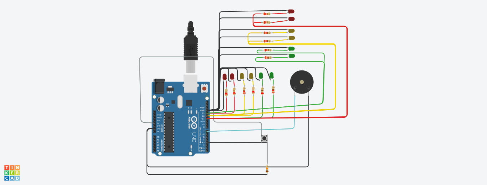

# Integrantes
- Sharlenne Azuaje
- Wendy Chiquipa
- Elias Rocca
- Agustín Oliveto

# Proyecto: Dojo Número Uno

# Descripción
Este proyecto tiene como objetivo actualizar los semáforos de la ciudad para un mejor y óptimo funcionamiento.

# Función Principal

Funcion 1: La funcion enciende el led verde y el buzzer. El buzzer va a sonara una frecuencia de 4000 dos veces por segundo, durante los 5 o 10 
segundos que el led verde dure encendido, dependiendo de cuando el usuario aprete el boton, luego va a titilar tres veces cuando termine
~~~ C (lenguaje en el que esta escrito)
void EncenderLedVerdeyBuzzer()
{
     if(boton == HIGH)
    {
      EncenderLed(LEDVERDE);
      for(int i = 0; i < 10; i++)
      {
        SonarBuzzer(7,4000,250);
        SonarBuzzer(7,4000,250); 
      }
      ApagarLed(LEDVERDE,1000);
      Titilar(LEDVERDE);
      boton = LOW;
    }
    else
    {
      EncenderLed(LEDVERDE);
      for(int i = 0; i < 5; i++)
      {
        SonarBuzzer(7,4000,250);
        SonarBuzzer(7,4000,250); 
      }
      ApagarLed(LEDVERDE,1000);
      Titilar(LEDVERDE);
    }
}
~~~
Funcion 2: La funcion enciende el led rojo y el buzzer. El buzzer va a sonar a una frecuencia de 4000 dos veces por segundo, durante los 5 segundos que el led rojo estará encendido
~~~ C (lenguaje en el que esta escrito)
void EncenderLedRojoYBuzzer(int led, int tiempoapagado)
{
  EncenderLed(led);
  for(int i = 0; i < 5; i++)
  {
    SonarBuzzer(7,4000,250);
    SonarBuzzer(7,4000,250); 
  }
  ApagarLed(led,tiempoapagado);
  
}
~~~
Funcion 3: La funcion enciende el led amarillo y el buzzer. El buzzer va a sonar a una frecuencia de 2000 una vez por segundo, durante los 3 segundos que el led rojo estará encendido
~~~ C (lenguaje en el que esta escrito)
void EncenderLedAmarilloyBuzzer(int led, int tiempoapagado)
{
  EncenderLed(led);
  for(int i=0; i < 3; i++)
  {
    SonarBuzzer(7,2000,500);
  }
  ApagarLed(led,tiempoapagado);
}
~~~

## :robot: Link al proyecto
- [proyecto](https://www.tinkercad.com/things/3BUTJKj7Tsi-parte-3/editel?sharecode=yr3AJWJQTiwPy_azX6z8f9smzdLtzlKj_AAkrXAOXjI)

